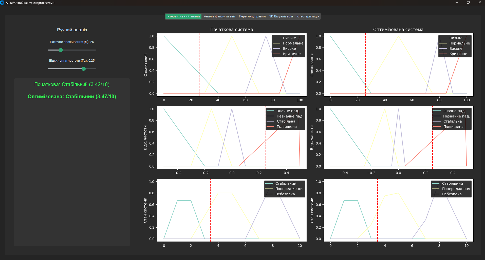
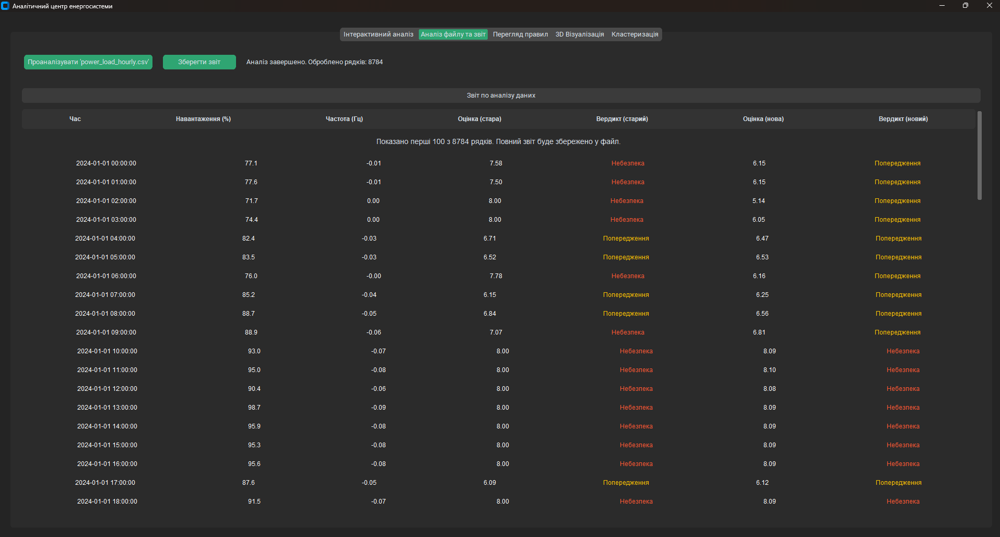
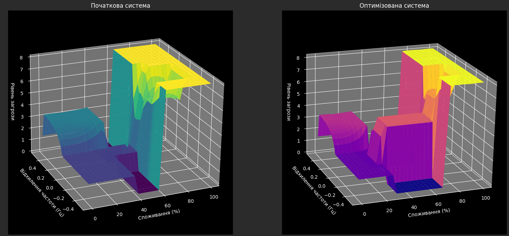
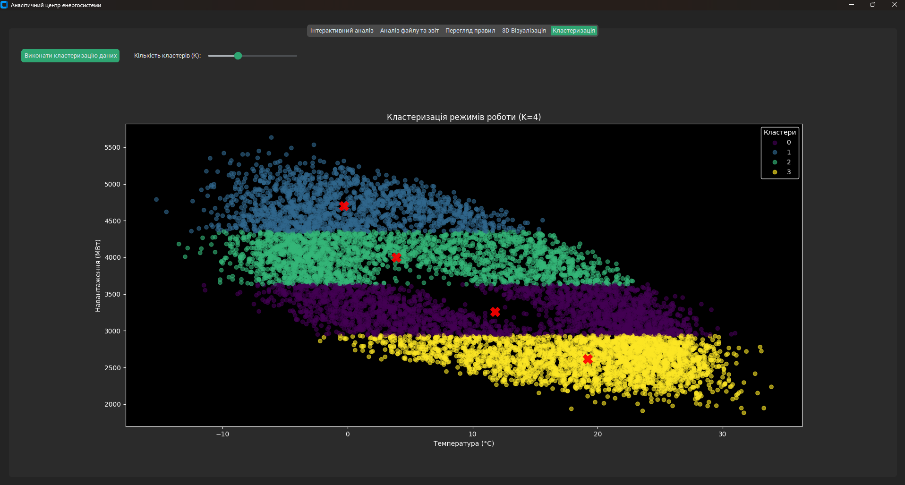
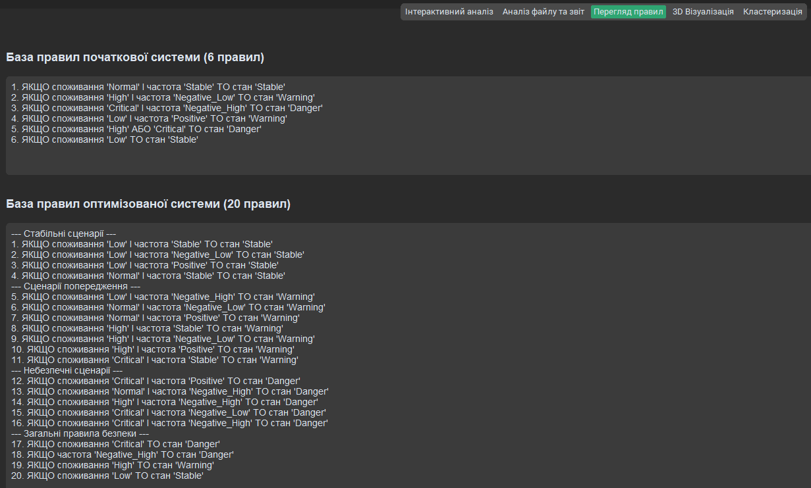

# Fuzzy Energy Dashboard: Аналітичний центр енергосистеми

**Fuzzy Energy Dashboard** — це десктопний застосунок, розроблений для моніторингу, аналізу та оцінки стану завантаженості енергосистеми. Проєкт створено як розширену лабораторну роботу з використанням нечіткої логіки (Fuzzy Logic) для імітації прийняття рішень експертом.

Система аналізує вхідні дані (споживання енергії та відхилення частоти) та надає експертну оцінку рівня загрози, використовуючи дві моделі: базову та оптимізовану з розширеною базою знань.

---

## 🚀 Основний функціонал

* **Інтерактивний аналіз:** Панель з повзунками для ручного моделювання ситуацій та миттєвою візуалізацією реакції системи на графіках функцій належності.
* **Автоматичний аналіз файлу:** Обробка великих `CSV`-файлів з даними про навантаження, автоматичний розрахунок оцінок та генерація звіту з кольоровими попередженнями.
* **Порівняння моделей:** Усі інструменти одночасно показують результати для **початкової (6 правил)** та **оптимізованої (20 правил)** експертних систем.
* **Перегляд бази знань:** Окрема вкладка для наочного перегляду та порівняння списку правил обох систем.
* **3D-візуалізація:** Побудова тривимірних "поверхонь відгуку" для візуального аналізу загальної поведінки кожної системи.
* **Кластерний аналіз:** Інструмент для пошуку прихованих закономірностей у даних за допомогою алгоритму K-Means (наприклад, для виявлення типових режимів роботи системи).

---

## 🛠️ Використані технології

* **Мова:** Python 3
* **Графічний інтерфейс:** CustomTkinter
* **Нечітка логіка:** scikit-fuzzy
* **Аналіз даних:** pandas
* **Візуалізація:** Matplotlib
* **Машинне навчання:** scikit-learn (для кластеризації)

---

## ⚙️ Встановлення та запуск

1.  **Клонуйте репозиторій:**
    ```bash
    git clone https://github.com/Lutvunenko-Dmutro/Fuzzy-Energy-Dashboard.git
    cd Fuzzy-Energy-Dashboard
    ```

2.  **Встановіть необхідні бібліотеки:**
    ```bash
    pip install -r requirements.txt
    ```
3.  **Підготуйте дані:**
    * Покладіть ваш файл з даними у корінь проєкту та перейменуйте його на `power_load_hourly.csv`.

4.  **Запустіть застосунок:**
    ```bash
    python desktop_app.py
    ```

---

## 🖼️ Галерея функціоналу

| Інтерактивний аналіз з графіками | Аналіз файлу та кольоровий звіт |
| :---: | :---: |
|  |  |

| 3D-поверхні відгуку | Кластеризація режимів роботи |
| :---: | :---: |
|  |  |

| Перегляд бази правил |
| :---: |
|  |
